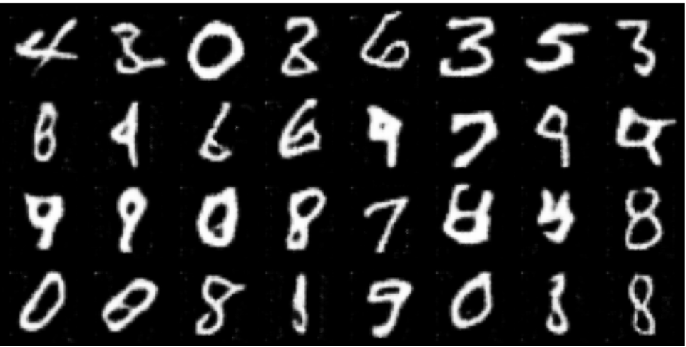

# Deep Convolutional Generative Adversarial Network (DCGAN) for MNIST Digit Generation

This project implements a Deep Convolutional Generative Adversarial Network (DCGAN) to generate handwritten digit images resembling those from the MNIST dataset.

## Overview

The GAN architecture consists of two neural networks: a Generator and a Discriminator. The Generator generates fake images, while the Discriminator attempts to distinguish between real and fake images. Both networks are trained simultaneously, with the Generator aiming to generate images that are indistinguishable from real images, and the Discriminator aiming to classify real and fake images correctly. The target images' size will be 64x64 with 1 color channel.

## Model Architecture

### Discriminator
- Input: MNIST digit images (1 channel, 64x64)
- Output: Binary classification (real or fake)
- Architecture:
  - Convolutional layers followed by batch normalization and leaky ReLU activation functions
  - Output layer with Sigmoid activation function for binary classification

### Generator
- Input: Random noise vector
- Output: Generated MNIST-like digit images (1 channel, 64x64)
- Architecture:
  - Convolutional transpose layers followed by batch normalization and ReLU activation functions
  - Output layer with Tanh activation function to generate pixel values in the range [-1, 1]

### Initialization and Training
- Weights of both networks are initialized using a normal distribution with mean 0 and standard deviation 0.02.
- The networks are trained using the Adam optimizer with a learning rate of 2e-4 and betas (0.5, 0.999).
- Binary Cross Entropy Loss is used as the loss function for both networks.

## Training Loop
- The training loop consists of alternating training steps for the Discriminator and the Generator.
- For each batch of real images from the MNIST dataset:
  1. The Discriminator is trained to classify real and fake images correctly.
  2. The Generator is trained to generate images classified as real by the Discriminator.
- The training process is repeated for a specified number of epochs.

## Results
- During training, the loss for the Discriminator and the Generator is printed regularly.
- Additionally, a grid of fake images generated by the Generator is displayed at regular intervals to visualize the progress of the Generator.

After 5 epochs:
  

## Dependencies
- PyTorch
- torchvision
- matplotlib

## Usage
1. Ensure the required dependencies are installed. Or run `pip install -r requirements.txt`.
2. Run the provided Python script to train the GAN.
3. After running, the `dataset` folder will be created automatically.
4. Monitor the training progress and view the generated images (change the variables `print_loss_interval` and `view_result_interval` to decide when to view the generation and the loss).

## Conclusion
This project demonstrates the use of GANs to generate realistic handwritten digit images. With further training and tuning, the GAN can generate high-quality digit images resembling those from the MNIST dataset.

